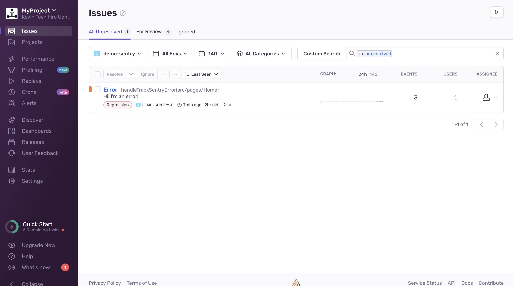
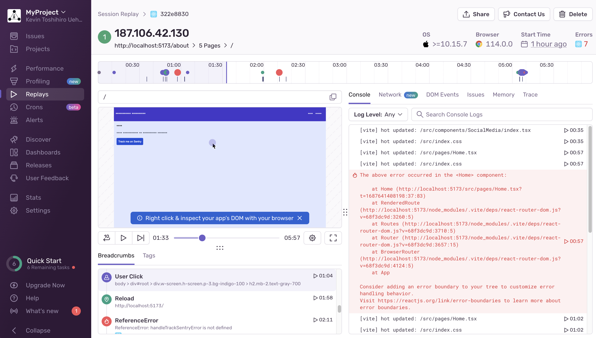
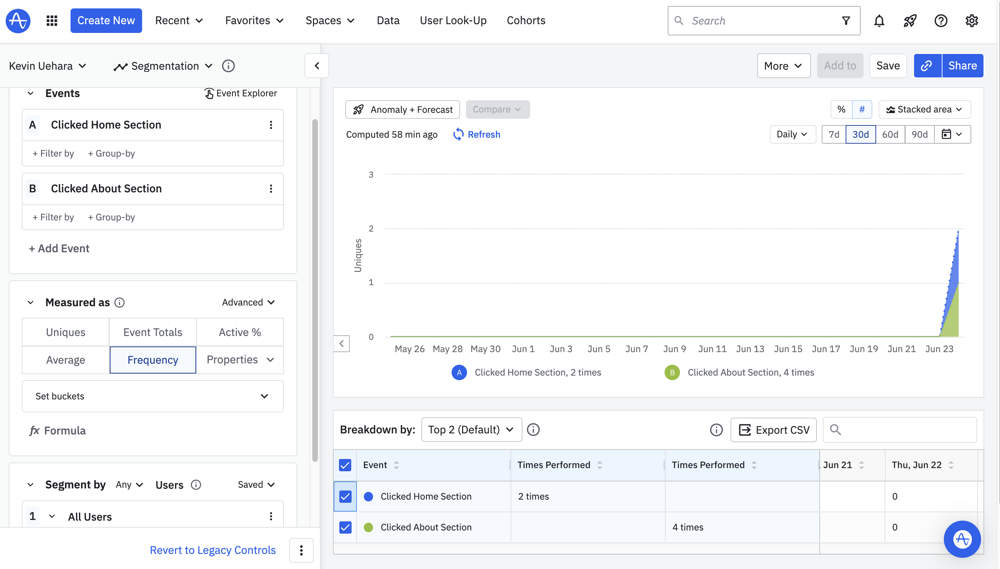
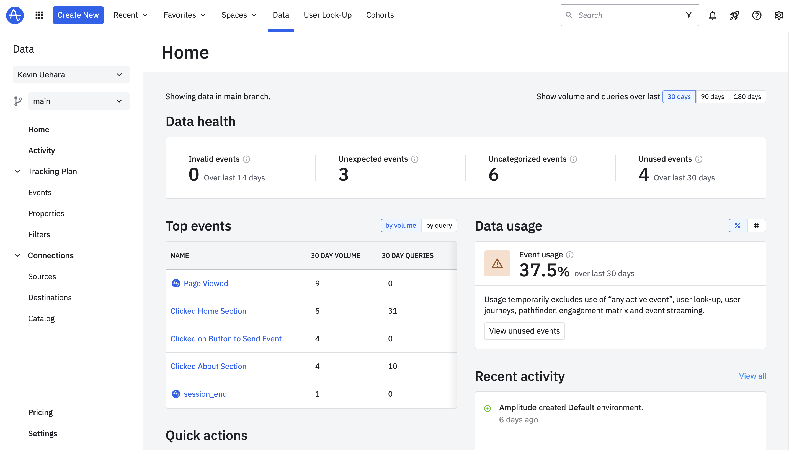
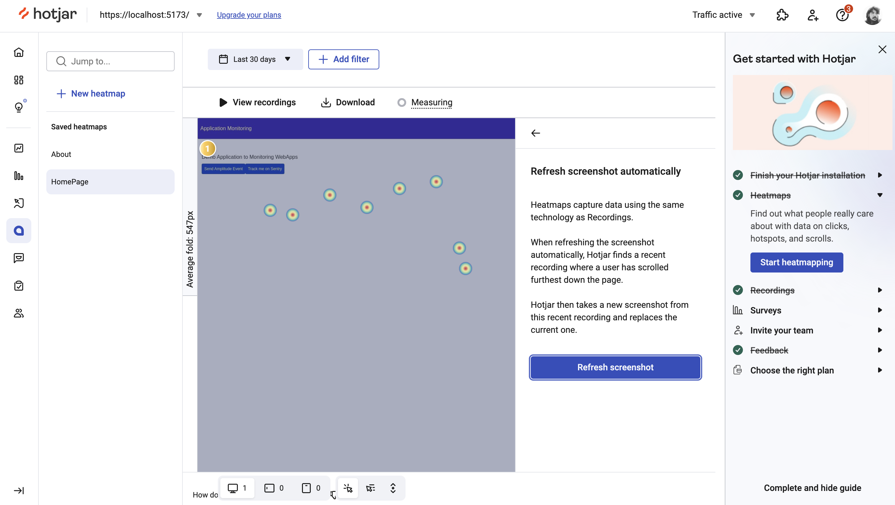

# WebApp Monitoring Example

This project is a example of a monitored application, using Sentry, Hotjar and Amplitude as providers.


**Sentry**: Open source project, sentry provides an **error tracking** in your web application. For software teams, Sentry is essential for monitoring application code health. From Error tracking to Performance monitoring, developers can see clearer, solve quicker, and learn continuously about their applications

**Amplitude**: Amplitude is a product analytics platform that helps businesses to track visitors with the help of collaborative analytics. The platform uses behavioral reports to understand users' interactions with products and provides insights to accelerate work on a real-time basis.

**Hotjar**: Hotjar is a product experience insights tool that gives you behavior analytics and feedback data to help you empathize with and understand your customers. You can use 'Observe' tools like Heatmaps and Recordings to see what your users see, and our 'Ask' tools like Surveys and a Feedback widget to bring your customers into the conversation.

Hotjar complements the data and insights you get from traditional product and web analytics tools like Google Analytics or Mixpanel. It’s an industry-leading and easy-to-use service that combines product experience insights, user behavior analysis, and customer feedback to help you connect the dots between what's happening on your site, and why it happens.

## Sentry




## Amplitude




## Hotjar




## Environments

It should create a `.env` file with bellow api keys

| Environment     | Description                   |
| --------------- | ----------------------------- |
| VITE_SENTRY_DSN | DSN of Sentry Key integration |
| VITE_AMPLITUDE  | API Key of Amplitude          |
| VITE_HOTJAR     | Key ID of Hotjar account      |

## Pre-requisites

- Node
- Yarn or NPM

## Feature Branch

There's 4 branches that you can use separated by each feature:

- `sentry`
- `hotjar`
- `amplitude`

And there's a branch with all providers integrations called: `all-integrations`

So, just use:

```sh
git checkout {some_branch}
```

- Node
- Yarn or NPM

## How to run?

1. Install dependencies

```sh
yarn
```

or

```sh
npm install
```

2. Running the project

```sh
yarn dev
```

or

```sh
npm run dev
```
